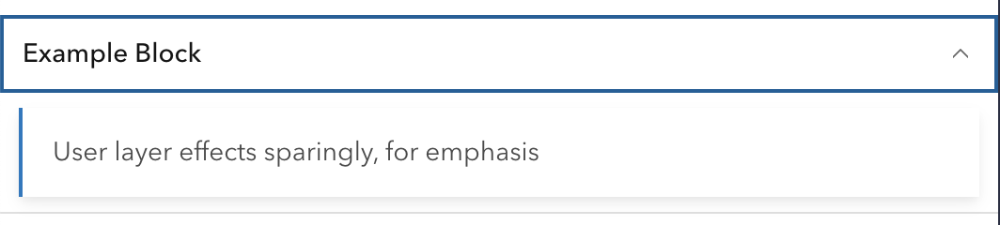

# Calcite Design System for R

The `{calcite}` package provides R bindings to Esri's [Calcite Design System](https://developers.arcgis.com/calcite-design-system/) designed to work directly with shiny or standalone html.

## Installation

The `{calcite}` package is available on GitHub. Install it using the following command

```{r, eval = FALSE}
remotes::install_github("r-arcgis/calcite")
```

## Usage


`{calcite}` consists of many components. See them all in the [official documntation](https://developers.arcgis.com/calcite-design-system/components/). 

Use the calcite components to scaffold the UI of your application. The below replicates the [navigation example](https://developers.arcgis.com/calcite-design-system/components/navigation).


```{r, eval = FALSE}
library(calcite)

calcite_shell(
  calcite_navigation(
    slot = "header",
    calcite_navigation_logo(
      slot = "logo",
      heading = "Snow Plow Map",
      description = "City of AcmeCo"
    ),
    calcite_menu(
      slot = "content-end",
      calcite_menu_item(text = "Drivers", `icon-start` = "license", `text-enabled` = TRUE),
      calcite_menu_item(text = "Routes", `icon-start` = "road-sign", `text-enabled` = TRUE),
      calcite_menu_item(text = "Forecast", `icon-start` = "snow", `text-enabled` = TRUE)
    ),
    calcite_navigation(
      slot = "navigation-secondary",
      calcite_menu(
        slot = "content-start",
        calcite_menu_item(breadcrumb = TRUE, text = "All Routes", `icon-start` = "book", `text-enabled` = TRUE),
        calcite_menu_item(breadcrumb = TRUE, text = "South Hills", `icon-start` = "apps", `text-enabled` = TRUE, active = TRUE)
      )
    ),
    calcite_navigation_user(slot = "user", `full-name` = "Wendell Berry", username = "w_berry")
  )
)
```


## Setting Attributes

Each component has attributes that can be set in their corresponding function. The `calcite_{component}()` functions take `...` as their only argument. To set attributes, they must be passed in as named values to the function. 

For example to use the [**Calcite UI Icons**](https://developers.arcgis.com/calcite-design-system/icons), the `icon` attribute must be set. 

```{r eval = FALSE}
calcite_icon(icon = "coordinate-system")
```


## Accessing Properties

The properties of each component is accessible via the `input` argument in a shiny `server` function. They can be accessed in the format of `input${id}_{property}`. Which returns a `list` with one element `values`.

In the below example a `calcite_block()` is created with an id of `block_container`. The `open` property can be observed and fetched using `input$block_container_open`.


```{r, eval = FALSE}
library(calcite)

ui <- calcite_shell(
  calcite_block(
    id = "block_container",
    collapsible = TRUE,
    heading = "Example Block",
    calcite_notice(open = TRUE, div(slot = "message", "User layer effects sparingly, for emphasis"))
  )
)

server <- function(input, output, session) {
  observeEvent(input$block_container_open, {
    is_open <- input$block_container_open$values
    cat(
      sprintf("Calcite block is %s\n", ifelse(is_open, "open", "closed"))
    )
  })
}

shiny::shinyApp(ui, server)
```



Opening and closing the block writes to the console:

```
Listening on http://127.0.0.1:3086
Calcite block is open
Calcite block is closed
Calcite block is open
Calcite block is closed
```

## Updating properties

Properties can be updated using the `update_calcite()` function which requires the `id` of the element to update and then named values pass to `...`. 


In this example we create a checkbox and an alert. When the checkbox is checked we show the alert by updating the `open` property using `update_calcite()`

```{r eval=FALSE}
ui <- calcite_shell(
  calcite_card(
    heading = "Content",
    calcite_label(
      layout = "inline",
      calcite_checkbox(id = "checked"),
      "Click me"
    )
  ),
  calcite_notice(
    id = "initial-note",
    div(slot = "title", "Nice!"),
    div(slot = "message", "This is a success message")
  )
)

server <- function(input, output, session) {
  observeEvent(input$checked_checked, {
    checked <- input$checked_checked$values
    # Update the `initial-note` property here
    update_calcite("initial-note", open = checked)
  })
}

shiny::shinyApp(ui, server)
```


## Full example

Included in the package is a full application that filters a `data.frame` of earth quakes. Run the app like so: 

```{r eval = FALSE}
app_file <- system.file("examples", "earthquake-app.R", package = "calcite")

shiny::runApp(app_file)
```


